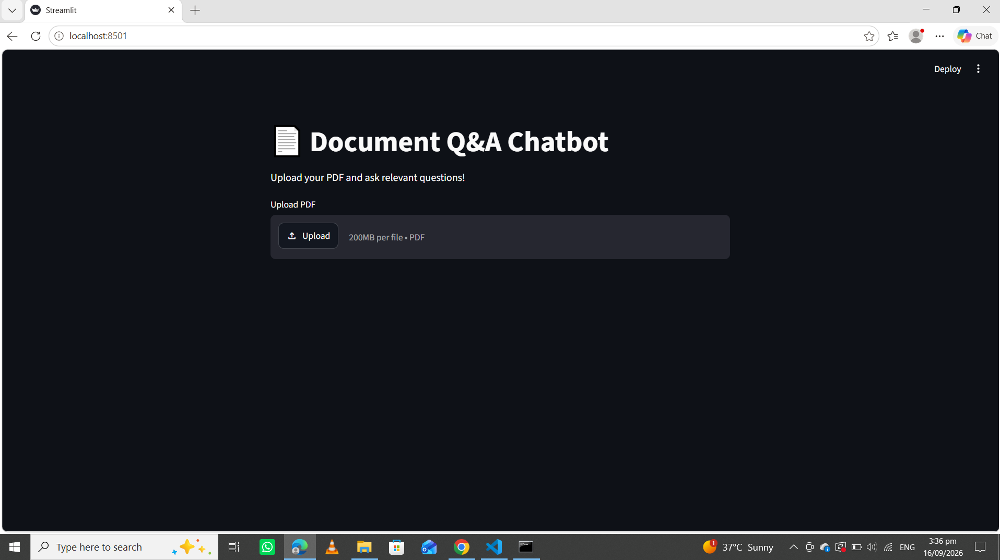
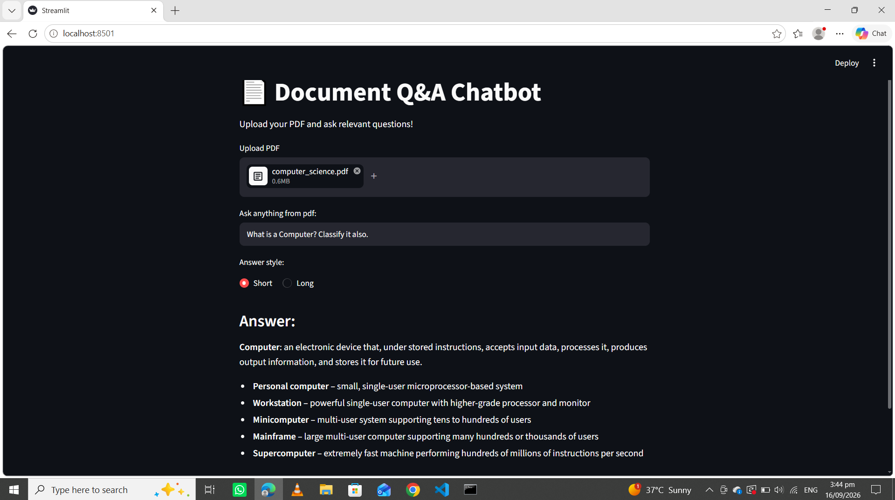
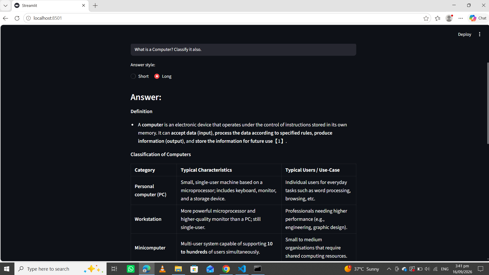

# 📄 Document Q&A Chatbot

A Retrieval-Augmented Generation (RAG) chatbot that lets you upload any PDF and ask natural language questions about its content. Built with open-source embeddings, ChromaDB vector search, and Groq's fast LLM inference — with a prompt specifically engineered to reduce hallucination and keep answers grounded in the source document.

## 📸 Screenshots

**Upload screen**


**Short answer — concise, bulleted**


**Long answer — detailed, with a Markdown table**


## ✨ Features

- **Upload any PDF** and ask questions about it in plain English
- **Grounded answers** — the model is instructed to answer only from the retrieved document content, and to say so honestly when information isn't available
- **Short / Long answer toggle** — get a quick scannable summary or a detailed explanation
- **Smart formatting** — key terms are bolded, lists become bullet points, and comparisons/differences are rendered as Markdown tables
- **Clean per-document retrieval** — each upload gets its own isolated vector collection, so answers never mix information from a previously uploaded document

## 🛠️ Tech Stack

| Component | Technology |
|---|---|
| Web UI | Streamlit |
| RAG orchestration | LangChain |
| LLM inference | Groq API (`openai/gpt-oss-120b`) |
| Vector database | ChromaDB |
| Embeddings | HuggingFace Sentence Transformers (`all-MiniLM-L6-v2`, local/free) |
| PDF parsing | PyMuPDF |

## ⚙️ How It Works

1. User uploads a PDF through the Streamlit interface
2. The document is split into overlapping chunks (1200 characters, 200 character overlap)
3. Chunks are embedded locally and stored in a fresh, uniquely-named ChromaDB collection
4. When a question is asked, the top 10 most relevant chunks are retrieved via similarity search
5. Retrieved chunks and the question are passed to the LLM using a carefully engineered prompt that enforces grounding, honesty, and formatting rules
6. The answer is streamed back and rendered in the UI, with automatic Markdown formatting (bold, bullets, tables)

## 🚀 Setup & Installation

```bash
git clone https://github.com/heresfatima/document-qa-chatbot.git
cd document-qa-chatbot

python -m venv venv
venv\Scripts\activate        # Windows
# source venv/bin/activate   # macOS/Linux

pip install -r requirements.txt
```

Create a `.env` file in the project root:

```
GROQ_API_KEY=your_groq_api_key_here
```

You can get a free API key from [console.groq.com](https://console.groq.com).

Run the app:

```bash
streamlit run app.py
```

## ⚠️ Known Limitations

- **PDF parsing**: complex layouts, scanned/image-only PDFs, or corrupted files may not extract text correctly. There is no OCR support yet, so scanned documents without a text layer won't work.
- **Model behavior**: the underlying open-source model can occasionally still blend information from closely related sections on very ambiguous questions, despite prompt-level safeguards.
- **No persistence**: each uploaded document's vector index exists only for the current session and is rebuilt from scratch on every new upload.
- **No source citations yet**: answers don't currently indicate which page or section of the document they were drawn from.

## 🔮 Future Improvements

- Show source citations (page numbers) alongside answers
- Support additional file formats (`.docx`, `.txt`)
- Hybrid search (keyword + semantic) for better retrieval
- Reranking of retrieved chunks for improved accuracy
- OCR support for scanned documents

## 📄 License

This project is licensed under the MIT License.
